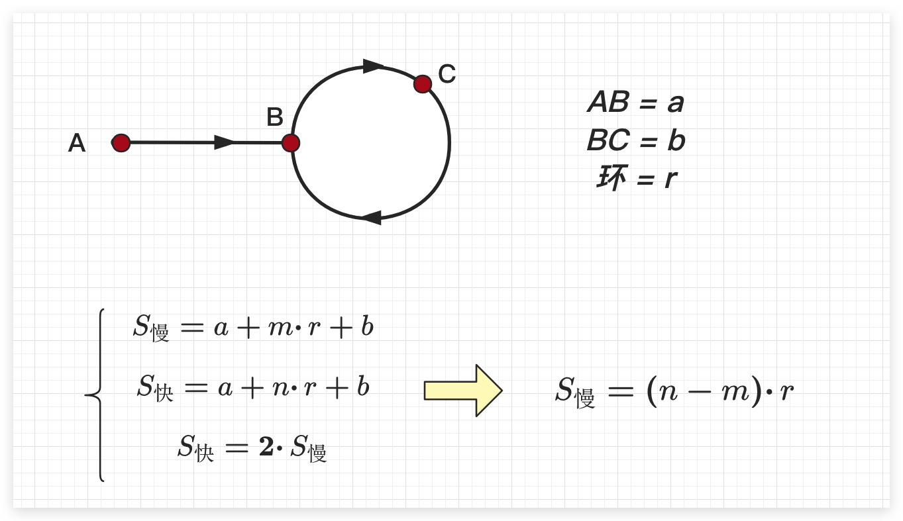

# 链表算法题

链表是 LeetCode 中非常重要的一类数据结构题型。与数组不同，链表不支持随机访问，但在插入和删除操作上具有天然优势。链表题目的核心通常围绕 **指针操作、结构变换和遍历技巧** 展开。掌握常见套路之后，大多数链表题都会变成“模板变形”。

## 一、链表基础结构与基本操作

在 LeetCode 中最常见的是 **单链表（Singly Linked List）**。

典型定义：

```cpp
struct ListNode {
    int val;
    ListNode *next;
    ListNode(int x) : val(x), next(NULL) {}
};
```

链表的核心特点：

- 每个节点包含 **值 + 指向下一个节点的指针**
- 只能 **顺序访问**
- 插入删除只需要修改指针

常见基础操作包括：

### 遍历链表

```cpp
ListNode* cur = head;
while (cur != nullptr) {
    cur = cur->next;
}
```

时间复杂度 O(n)。

### 插入节点

在节点 `prev` 后插入 `node`：

```cpp
node->next = prev->next;
prev->next = node;
```

### 删除节点

删除 `prev->next`：

```cpp
prev->next = prev->next->next;
```

### 虚拟头节点（Dummy Node）

这是链表题中非常重要的技巧。

作用：

- 统一处理头节点
- 避免单独判断 head

模板：

```cpp
ListNode dummy(0);
dummy.next = head;
ListNode* cur = &dummy;
```

典型题：

- 203 Remove Linked List Elements
- 19 Remove Nth Node From End of List
- 21 Merge Two Sorted Lists

## 二、双指针（快慢指针）

快慢指针是链表题中最核心技巧之一。

思想是：

一个指针走得快，一个指针走得慢，通过速度差实现各种操作。

### 1 判断链表是否有环

#### Floyd判圈算法

Floyd判圈算法(Floyd Cycle Detection Algorithm)，又称龟兔赛跑算法(Tortoise and Hare Algorithm)，是一个可以在有限状态机、迭代函数或者链表上判断是否存在环，求出该环的起点与长度的算法。该算法据高德纳称由美国科学家罗伯特·弗洛伊德发明，但这一算法并没有出现在罗伯特·弗洛伊德公开发表的著作中。

如果有限状态机、迭代函数或者链表上存在环，那么在某个环上以**不同速度**前进的2个指针必定会在某个时刻相遇。同时显然地，如果从同一个起点(即使这个起点不在某个环上)同时开始以不同速度前进的2个指针最终相遇，那么可以判定存在一个环，且可以求出二者相遇处所在的环的起点与长度。

这里令起始处为A、环的入口处为B，在判断是否有环阶段时快慢相遇之处为C。并记AB长度为a、记BC长度为b、环的长度为r。且在判断是否有环过程中，快指针每次走2步、慢指针每次走1步。则快、慢指针相遇时，快指针走过的长度是慢指针走过长度的2倍。

此时不难看出，当快、慢指针相遇时，快、慢指针走过的长度均是环长度的整数倍。故如果期望找到环的入口位置，即B处。则只需在两个指针相遇之时，将其中任意一个指针放置到起始处A，而另一个指针依然位于相遇处C。然后两个指针按照每次均走1步的速度向前走，当二者再次相遇之时，即是B处。
原因在于，对于相遇后继续往前走的指针而言，由于其已经走过了若干圈环的长度，此时只需再走a步即可到达环的入口。这个地方换个角度想会更容易理解，如果该指针先走a步再走若干圈环的长度，其必然位于环的入口处；而对于相遇后从起始处A开始走的指针而言，其显然走a步后，必然也会位于环的入口处。故此时两个指针第二次相遇之时，说明他们均已经走完a步。即到达环的入口处。

经典题：

LeetCode 141

**Floyd 判环算法：**

- slow 每次走一步
- fast 每次走两步
- 如果相遇则存在环

```cpp
ListNode* slow = head;
ListNode* fast = head;

while (fast && fast->next) {
    slow = slow->next;
    fast = fast->next->next;
    if (slow == fast) return true;
}
return false;
```

时间复杂度 O(n)，空间复杂度 O(1)。

### 2 找到环的入口

经典题：

LeetCode 142

结论：

设链表如下结构：

- 从头节点到环入口的距离为 **a**
- 从环入口到相遇点的距离为 **b**
- 从相遇点回到入口的距离为 **c**

假设快慢指针第一次在环中相遇。

慢指针走过的距离为

```cpp
slow = a + b
```

快指针走过的距离为

```cpp
fast = a + b + nL
```

其中：

```cpp
n ≥ 1
```

表示快指针比慢指针多走的环数。

fast = 2*slow -> a+b+nL = 2(a+b) -> a+b = nL

L = b + c 

所以 a = n(b+c) - b

展开：a= (n-1)(b+c) +c = (n-1)L +c 

所以 a= (n-1)L +c

从 **头节点到入口的距离 a**等于(n − 1) 个完整环长度 + 从相遇点到入口的距离 c

**说明同时从头节点和相遇节点出发的两个指针，每次走 1 步，最终会在入口处相遇。**

```cpp
/**
 * Definition for singly-linked list.
 * struct ListNode {
 *     int val;
 *     ListNode *next;
 *     ListNode(int x) : val(x), next(nullptr) {}
 * };
 */

class Solution {
public:
    ListNode *detectCycle(ListNode *head) {
        if (head == nullptr || head->next == nullptr) {
            return nullptr;
        }

        ListNode* slow = head;
        ListNode* fast = head;

        // 第一步：判断是否有环
        while (fast != nullptr && fast->next != nullptr) {
            slow = slow->next;
            fast = fast->next->next;

            if (slow == fast) {
                // 第二步：从头节点和相遇点同时出发
                ListNode* p1 = head;
                ListNode* p2 = slow;

                while (p1 != p2) {
                    p1 = p1->next;
                    p2 = p2->next;
                }

                return p1; // 环入口
            }
        }

        return nullptr; // 无环
    }
};
```


### 3 找链表中点

常用于：

- 回文链表
- 拆分链表

模板：

假如总体走的次数是a次，此时

快针到达了总长度节点n，速度为n/a

那么慢针走的路程为n/2a*a= n/2

```python
ListNode *endOfFirstHalf(ListNode *head) {
    ListNode *fast = head;
    ListNode *slow = head;
    while (fast->next != nullptr && fast->next->next != nullptr) {
        fast = fast->next->next;
        slow = slow->next;
    }
    return slow;
}
```

最终：

slow 指向 **中点**

典型题：

- 876 Middle of the Linked List
- 234 Palindrome Linked List

### 4 删除倒数第 k 个节点

经典题：

LeetCode 19

思路：

两个指针间隔 k

流程：

1. fast 先走 k 步
2. slow 和 fast 一起走
3. fast 到尾部时 slow 指向目标前一个节点

代码模板：

```python
fast = head
for i in range(k):
    fast = fast->next

while fast:
    slow = slow->next
    fast = fast->next
```

## 三、链表反转

链表反转是最经典问题之一。

典型题：

- 206 Reverse Linked List
- 92 Reverse Linked List II
- 25 Reverse Nodes in k Group

### 1 整体反转

核心思想是 **不断改变 next 指针方向**。

模板：

```cpp
ListNode* prev = nullptr;
ListNode* cur = head;

while (cur) {
    ListNode* next = cur->next;
    cur->next = prev;
    prev = cur;
    cur = next;
}

return prev;
```

时间复杂度 O(n)。

### 2 递归反转

```cpp
ListNode* reverse(ListNode* head) {
    if (!head || !head->next) return head;

    ListNode* newHead = reverse(head->next);

    head->next->next = head;
    head->next = nullptr;

    return newHead;
}
```

### 3 区间反转

经典题：

LeetCode 92

核心步骤：

1. 找到 left 前一个节点
2. 对区间进行头插反转

### 4 K 个一组反转

经典题：

LeetCode 25

核心思路：

1. 找到 k 个节点
2. 反转这 k 个
3. 递归处理后续链表

### 案例

#### 206. 反转链表

简单就是需要加上一个nullptr的pre和记录当前的next，方便待会继续往后

```cpp
 */
class Solution {
public:
    ListNode* reverseList(ListNode* head) {
        ListNode *prev = nullptr;
        ListNode *pA = head;
        while(pA!=nullptr)
        {
            ListNode *next = pA ->next;
            pA -> next = prev;
            prev = pA;
            pA = next;
        }
        return prev;
    }
};
```

#### [234. 回文链表](https://leetcode.cn/problems/palindrome-linked-list/)

结合一下上一个题目,但是这里要注意深浅拷贝

```cpp
/**
 * Definition for singly-linked list.
 * struct ListNode {
 *     int val;
 *     ListNode *next;
 *     ListNode() : val(0), next(nullptr) {}
 *     ListNode(int x) : val(x), next(nullptr) {}
 *     ListNode(int x, ListNode *next) : val(x), next(next) {}
 * };
 */
class Solution {
public:
    bool isPalindrome(ListNode* head) {
        ListNode *pA = head;
        ListNode *pB = reverseList(cloneList(head));
        while(pA){
            if(pA->val!= pB->val){
                return false;
            }else{
                pA = pA -> next;
                pB = pB -> next;
            }
        }
        return true;
    }

    ListNode *cloneList(ListNode *head){
        ListNode dummy(0);
        ListNode *tail = &dummy;
        while(head){
            tail->next = new ListNode(head->val);
            tail = tail->next;
            head = head->next;
        }
        return dummy.next;
    }
     
    ListNode *reverseList(ListNode *head){
        ListNode *prev =nullptr;
        ListNode *current= head;
        while(current!=nullptr){
            ListNode *next = current -> next;
            current -> next = prev;
            prev = current;
            current = next;
        }
        return prev;
    }
};
```

##### 优化

现在的实现优化点：

1. 去掉整条链表 `clone`，不再大量 `new` 节点
2. 用快慢指针找到前半段结尾
3. 只反转后半段，再逐个比较
4. 比较结束后把后半段再反转回去，保证原链表结构不变

复杂度变化：

1. 原来：时间 `O(n)`，但有额外空间 `O(n)`（拷贝整链表）
2. 现在：时间 `O(n)`，额外空间 `O(1)`

```cpp
class Solution {
public:
    bool isPalindrome(ListNode* head) {
        if (head == nullptr || head->next == nullptr) {
            return true;
        }

        ListNode *firstHalfEnd = endOfFirstHalf(head);
        ListNode *secondHalfStart = reverseList(firstHalfEnd->next);

        bool result = true;
        ListNode *p1 = head;
        ListNode *p2 = secondHalfStart;
        while (result && p2 != nullptr) {
            if (p1->val != p2->val) {
                result = false;
            }
            p1 = p1->next;
            p2 = p2->next;
        }

        // Restore list structure so caller sees original list unchanged.
        firstHalfEnd->next = reverseList(secondHalfStart);
        return result;
    }

    ListNode *endOfFirstHalf(ListNode *head) {
        ListNode *fast = head;
        ListNode *slow = head;
        while (fast->next != nullptr && fast->next->next != nullptr) {
            fast = fast->next->next;
            slow = slow->next;
        }
        return slow;
    }
     
    ListNode *reverseList(ListNode *head){
        ListNode *prev =nullptr;
        ListNode *current= head;
        while(current!=nullptr){
            ListNode *next = current -> next;
            current -> next = prev;
            prev = current;
            current = next;
        }
        return prev;
    }
};
```

#### 141.环形链表

```cpp
/**
 * Definition for singly-linked list.
 * struct ListNode {
 *     int val;
 *     ListNode *next;
 *     ListNode(int x) : val(x), next(NULL) {}
 * };
 */
class Solution {
public:
    bool hasCycle(ListNode *head) {
        if(head == nullptr || head -> next == nullptr){
            return false;
        }

        ListNode *slow = head;
        ListNode *fast = head;
        while(fast!=nullptr && fast->next!=nullptr){
            fast = fast -> next ->next;
            slow = slow -> next;
            if(slow==fast){ 
                return true;
                // ListNode *p1 = head;
                // ListNode *p2 = slow;
                // while(p1!=p2){
                //     p1 = p1 -> next;
                //     p2 = p2 -> next;
                // }
            }

        }
        return  false;
        
    }
};
```

#### [142. 进阶环形链表 II](https://leetcode.cn/problems/linked-list-cycle-ii/)

```cpp
/**
 * Definition for singly-linked list.
 * struct ListNode {
 *     int val;
 *     ListNode *next;
 *     ListNode(int x) : val(x), next(NULL) {}
 * };
 */
class Solution {
public:
    ListNode *detectCycle(ListNode *head) {
        if(head==nullptr || head->next == nullptr){
            return nullptr;
        }

        ListNode *slow = head;
        ListNode *fast = head;
        
        while(fast!=nullptr && fast -> next != nullptr){
            slow = slow -> next;
            fast = fast -> next -> next;
            if(slow == fast){
                ListNode *pA = head;
                ListNode *pB = slow;
                while(pA!=pB){
                    pA = pA -> next;
                    pB = pB -> next;
                }

                return pA;
            }
        }
        return nullptr;
    }
};
```


## 四、链表合并

链表经常需要 **合并两个有序链表**。

经典题：

- 21 Merge Two Sorted Lists
- 23 Merge K Sorted Lists

### 合并两个有序链表

核心思想类似 **归并排序 merge**。

```cpp
ListNode dummy(0);
ListNode* cur = &dummy;

while (l1 && l2) {
    if (l1->val < l2->val) {
        cur->next = l1;
        l1 = l1->next;
    } else {
        cur->next = l2;
        l2 = l2->next;
    }
    cur = cur->next;
}

cur->next = l1 ? l1 : l2;

return dummy.next;
```

时间复杂度 O(n)。


## 五、链表重排

这类题通常是 **结构变换型题目**。

典型题：

- 143 Reorder List
- 61 Rotate List

### Reorder List

题意：

```
L0 → L1 → L2 → ... → Ln
变成
L0 → Ln → L1 → Ln-1 → ...
```

解题步骤：

1 找中点
 2 反转后半链表
 3 交替合并

这是一个 **三步骤套路题**。

## 六、链表排序

经典题：

LeetCode 148 Sort List

要求：

时间复杂度 O(n log n)

解法：

**归并排序**

流程：

1 找中点拆分链表
 2 递归排序
 3 合并链表

链表适合归并排序，因为：

- 不需要额外空间
- 合并操作 O(1)

## 七、链表与哈希表

有些链表题会结合 **哈希表**。

典型题：

- 146 LRU Cache
- 138 Copy List with Random Pointer

### LRU Cache

核心结构：

```
HashMap + 双向链表
```

作用：

- HashMap 实现 O(1) 查找
- 双向链表维护访问顺序

双向链表结构：

```
head <-> node <-> node <-> tail
```

最近访问节点移动到头部。


## 八、链表深拷贝

经典题：

LeetCode 138

节点结构：

```
next
random
```

常见解法：

### 方法一 哈希表

步骤：

1 建立 old -> new 映射
 2 设置 next
 3 设置 random

时间 O(n)
 空间 O(n)

### 方法二 O(1) 空间

步骤：

1 复制节点插入原链表
 2 复制 random
 3 拆分链表

这个方法是经典技巧。

## 九、链表常见套路总结

LeetCode 链表题几乎都围绕以下几种模式：

1 快慢指针

- 找中点
- 找环
- 找倒数节点

2 虚拟头节点

- 删除节点
- 插入节点
- 合并链表

3 反转链表

- 整体反转
- 区间反转
- K 组反转

4 链表拆分与合并

- Merge
- Reorder
- Sort List

5 链表 + 哈希表

- LRU
- 随机指针复制