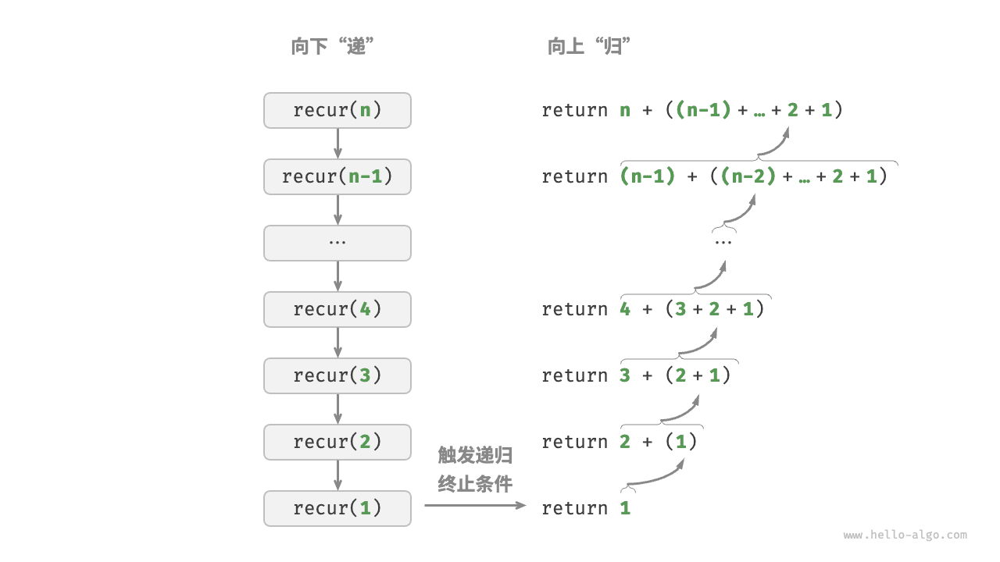

# 数据结构与算法

## 复杂度分析

### 1.1 算法效率评估

在算法设计中，我们先后追求以下两个层面的目标。

1. **找到问题解法**：算法需要在规定的输入范围内可靠地求得问题的正确解。
2. **寻求最优解法**：同一个问题可能存在多种解法，我们希望找到尽可能高效的算法。

也就是说，在能够解决问题的前提下，算法效率已成为衡量算法优劣的主要评价指标，它包括以下两个维度。

- **时间效率**：算法运行时间的长短。
- **空间效率**：算法占用内存空间的大小。

#### 1.1.1 理论估算

由于实际测试具有较大的局限性，我们可以考虑仅通过一些计算来评估算法的效率。这种估算方法被称为渐近复杂度分析（asymptotic complexity analysis），简称复杂度分析。

复杂度分析能够体现算法运行所需的时间和空间资源与输入数据规模之间的关系。**它描述了随着输入数据规模的增加，算法执行所需时间和空间的增长趋势**。这个定义有些拗口，我们可以将其分为三个重点来理解。

- “时间和空间资源”分别对应时间复杂度（time complexity）和空间复杂度（space complexity）。
- “随着输入数据规模的增加”意味着复杂度反映了算法运行效率与输入数据规模之间的关系。
- “时间和空间的增长趋势”表示复杂度分析关注的不是运行时间或占用空间的具体值，而是时间或空间增长的“快慢”。

### 1.2 迭代和递归

在算法中，重复执行某个任务是很常见的，它与复杂度分析息息相关。因此，在介绍时间复杂度和空间复杂度之前，我们先来了解如何在程序中实现重复执行任务，即两种基本的程序控制结构：迭代、递归。

#### 1.2.1 迭代

`for` 循环是最常见的迭代形式之一，**适合在预先知道迭代次数时使用**。

与 `for` 循环类似，`while` 循环也是一种实现迭代的方法。在 `while` 循环中，程序每轮都会先检查条件，如果条件为真，则继续执行，否则就结束循环。

**`while` 循环比 `for` 循环的自由度更高**。在 `while` 循环中，我们可以自由地设计条件变量的初始化和更新步骤。

#### 1.2.2 递归

递归（recursion）是一种算法策略，通过函数调用自身来解决问题。它主要包含两个阶段。

1. **递**：程序不断深入地调用自身，通常传入更小或更简化的参数，直到达到“终止条件”。
2. **归**：触发“终止条件”后，程序从最深层的递归函数开始逐层返回，汇聚每一层的结果。

而从实现的角度看，递归代码主要包含三个要素。

1. **终止条件**：用于决定什么时候由“递”转“归”。
2. **递归调用**：对应“递”，函数调用自身，通常输入更小或更简化的参数。
3. **返回结果**：对应“归”，将当前递归层级的结果返回至上一层。



递归函数每次调用自身时，系统都会为新开启的函数分配内存，以存储局部变量、调用地址和其他信息等。这将导致两方面的结果。

- 函数的上下文数据都存储在称为“栈帧空间”的内存区域中，直至函数返回后才会被释放。因此，**递归通常比迭代更加耗费内存空间**。
- 递归调用函数会产生额外的开销。**因此递归通常比循环的时间效率更低**。


从本质上看，递归体现了“将问题分解为更小子问题”的思维范式，这种分治策略至关重要。

- 从算法角度看，搜索、排序、回溯、分治、动态规划等许多重要算法策略直接或间接地应用了这种思维方式。
- 从数据结构角度看，递归天然适合处理链表、树和图的相关问题，因为它们非常适合用分治思想进行分析。

### 1.3 时间复杂度计算

#### 1.3.1 计算方法

**第一步：统计操作数量**

针对代码，逐行从上到下计算即可。然而，由于上述 中的常数系数 可以取任意大小，**因此操作数量 中的各种系数、常数项都可以忽略**。根据此原则，可以总结出以下计数简化技巧。

1. **忽略n中的常数**。因为它们都与n无关，所以对时间复杂度不产生影响。
2. **省略所有系数**。例如，循环2n次等，都可以简化记为n次，因为前面的系数对时间复杂度没有影响。
3. **循环嵌套时使用乘法**。总操作数量等于外层循环和内层循环操作数量之积，每一层循环依然可以分别套用第 `1.` 点和第 `2.` 点的技巧。

**第二步：判断渐近上界**

**时间复杂度由 $T_{(n)}$ 中最高阶的项来决定**。这是因为在 $n$ 趋于无穷大时，最高阶的项将发挥主导作用，其他项的影响都可以忽略。

#### 1.3.2 常见类型

设输入数据大小为 ，常见的时间复杂度类型如下所示：
$$
O(1)<O(\log n)<O(n)<O(n)<O(n!)<O(n^2)<O(2^n)<O(n!)\\\text{常数阶}<\text{对数阶}<\text{线性阶}<\text{平方阶}<\text{指数阶}<\text{阶乘阶}
$$


- 常数阶的操作数量与输入数据大小无关，即不随着n的变化而变化。
- 指数阶增长非常迅速，在穷举法（暴力搜索、回溯等）中比较常见。对于数据规模较大的问题，指数阶是不可接受的，通常需要使用动态规划或贪心算法等来解决。

与指数阶相反，对数阶反映了“每轮缩减到一半”的情况。设输入数据大小为 \(n\)，由于每轮缩减到一半，因此循环次数是 \(\log_2 n\)，即 \(2^n\) 的反函数。

### 1.4 空间复杂度

空间复杂度的推算方法与时间复杂度大致相同，只需将统计对象从“操作数量”转为“使用空间大小”。 而与时间复杂度不同的是，**我们通常只关注最差空间复杂度**。这是因为内存空间是一项硬性要求，我们必须确保在所有输入数据下都有足够的内存空间预留。 观察以下代码，最差空间复杂度中的“最差”有两层含义。

1. **以最差输入数据为准**：当 $n < 10$ 时，空间复杂度为 $O(1)$；但当 $n > 10$ 时，初始化的数组 `nums` 占用 $O(n)$ 空间，因此最差空间复杂度为 $O(n)$。 
2. **以算法运行中的峰值内存为准**：例如，程序在执行最后一行之前，占用 $O(1)$ 空间；当初始化数组 `nums` 时，程序占用 $O(n)$ 空间，因此最差空间复杂度为 $O(n)$。

## 基本数据结构

### 2.1 数据结构分类

常见的数据结构包括数组、链表、栈、队列、哈希表、树、堆、图，它们可以从“逻辑结构”和“物理结构”两个维度进行分类。

#### 2.1.1 逻辑结构

**逻辑结构揭示了数据元素之间的逻辑关系**。在数组和链表中，数据按照一定顺序排列，体现了数据之间的线性关系；而在树中，数据从顶部向下按层次排列，表现出“祖先”与“后代”之间的派生关系；图则由节点和边构成，反映了复杂的网络关系。

如图所示，逻辑结构可分为“线性”和“非线性”两大类。线性结构比较直观，指数据在逻辑关系上呈线性排列；非线性结构则相反，呈非线性排列。

- **线性数据结构**：数组、链表、栈、队列、哈希表，元素之间是一对一的顺序关系。
- **非线性数据结构**：树、堆、图、哈希表，数据元素之间是一对多或多对多关系。

非线性数据结构可以进一步划分为树形结构和网状结构。

- **树形结构**：树、堆、哈希表，元素之间是一对多的关系。
- **网状结构**：图，元素之间是多对多的关系。


#### 2.1.2 基本数据结构

##### 数组

数组是一种顺序存储的线性结构，元素在内存中连续存储，支持随机访问。

定长数组

```cpp
int arr[10];
```

二维数组

```cpp
int matrix[3][4];
```

动态数组

```cpp
#include <vector>
using namespace std;

vector<int> nums;
vector<int> nums2(10);
vector<int> nums3(10, 5);
```

##### 字符串 String

字符串用于表示字符序列，在 C++ 中通常使用 `string` 类型或字符数组表示。

string 类型

```cpp
#include <string>
using namespace std;

string s = "hello";
```

字符数组

```cpp
char s[100] = "hello";
```

##### 链表 Linked List

链表是一种链式存储结构，每个节点包含数据和指向下一个节点的指针。

单链表

```cpp
struct ListNode {
    int val;
    ListNode* next;

    ListNode(int x) : val(x), next(nullptr) {}
};
```

双链表

```cpp
struct DListNode {
    int val;
    DListNode* prev;
    DListNode* next;

    DListNode(int x) : val(x), prev(nullptr), next(nullptr) {}
};
```

##### 栈 Stack

栈是一种后进先出（LIFO）的数据结构。

```cpp
#include <stack>
using namespace std;

stack<int> st;

st.push(1);
st.push(2);
st.pop();
int x = st.top();
```

##### 队列 Queue

队列是一种先进先出（FIFO）的数据结构。

```cpp
#include <queue>
using namespace std;

queue<int> q;

q.push(1);
q.push(2);
q.pop();
int x = q.front();
```

双端队列 Deque

```cpp
#include <deque>
using namespace std;

deque<int> dq;

dq.push_front(1);
dq.push_back(2);
dq.pop_front();
dq.pop_back();
```

##### 哈希表 Hash Table

哈希表通过哈希函数实现快速查找，平均时间复杂度为 O(1)。

```cpp
#include <unordered_map>
using namespace std;

unordered_map<string, int> mp;

mp["apple"] = 3;
mp["banana"] = 5;
```

集合结构（集合用于存储 **不重复的元素**。）

```cpp
#include <unordered_set>
using namespace std;

unordered_set<int> st;

st.insert(1);
st.insert(2);
```

##### 树 Tree

树是一种层次结构的数据结构。

二叉树节点定义

```cpp
struct TreeNode {
    int val;
    TreeNode* left;
    TreeNode* right;

    TreeNode(int x) : val(x), left(nullptr), right(nullptr) {}
};
```

##### 堆 Heap

堆通常用于实现优先队列，是一种完全二叉树结构。

大根堆

```cpp
#include <queue>
using namespace std;

priority_queue<int> pq;
```

小根堆

```cpp
#include <queue>
#include <vector>
#include <functional>
using namespace std;

priority_queue<int, vector<int>, greater<int>> pq;
```

##### 图 Graph

图由顶点（Vertex）和边（Edge）组成。

邻接矩阵

```cpp
int graph[100][100];
```

邻接表

```cpp
#include <vector>
using namespace std;

vector<int> graph[100];
```


### 2.2 基本数据类型

基本数据类型（Primitive Data Types）是编程语言中最基础的数据表示形式，用于存储简单的数据值。在 C++ 中常见的基本数据类型如下表所示。

| 类型         | 关键字        | 示例                           | 典型大小     | 说明                |
| ------------ | ------------- | ------------------------------ | ------------ | ------------------- |
| 整型         | `int`         | `int a = 10;`                  | 4 bytes      | 最常用的整数类型    |
| 短整型       | `short`       | `short b = 5;`                 | 2 bytes      | 较小范围整数        |
| 长整型       | `long`        | `long c = 1000;`               | 4 或 8 bytes | 表示较大整数        |
| 长长整型     | `long long`   | `long long d = 10000000000LL;` | 8 bytes      | 表示更大的整数      |
| 单精度浮点型 | `float`       | `float a = 3.14f;`             | 4 bytes      | 精度较低的小数      |
| 双精度浮点型 | `double`      | `double b = 3.1415926;`        | 8 bytes      | 最常用的浮点数      |
| 高精度浮点型 | `long double` | `long double c = 3.14;`        | 8 / 16 bytes | 更高精度的小数      |
| 字符型       | `char`        | `char c = 'a';`                | 1 byte       | 存储单个字符        |
| 布尔型       | `bool`        | `bool flag = true;`            | 1 byte       | 逻辑值 true / false |

## 栈与队列

栈（Stack）和队列（Queue）都是常见的**线性数据结构**，它们的特点是对数据的访问和操作有特定的顺序限制，因此也被称为**受限线性结构**。

#### 栈 Stack

栈是一种**后进先出（Last In First Out，LIFO）**的数据结构，最后进入栈的元素最先被取出。

可以把栈理解为一摞盘子：

新放上去的盘子一定是最先被拿走的。

##### 栈的基本操作

| 操作      | 说明                    |
| --------- | ----------------------- |
| `push(x)` | 入栈，将元素 x 放入栈顶 |
| `pop()`   | 出栈，删除栈顶元素      |
| `top()`   | 查看栈顶元素            |
| `empty()` | 判断栈是否为空          |
| `size()`  | 返回栈中元素数量        |

##### C++ 实现

```cpp
#include <stack>
using namespace std;

stack<int> st;

// 入栈
st.push(10);
st.push(20);

// 查看栈顶
int x = st.top();

// 出栈
st.pop();

// 判断是否为空
bool isEmpty = st.empty();
```


## 参考

[1] https://www.hello-algo.com/chapter_computational_complexity/time_complexity/#3-on2